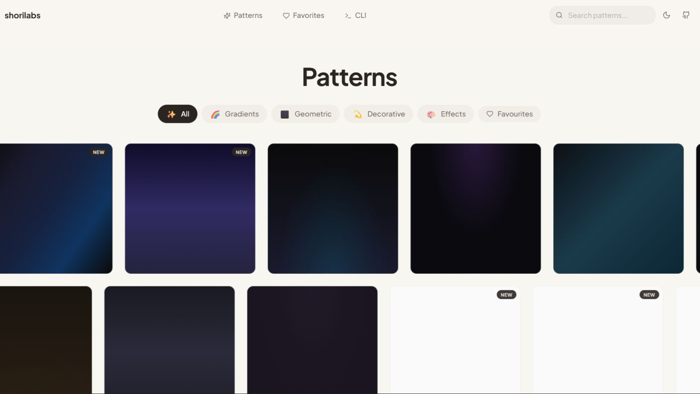
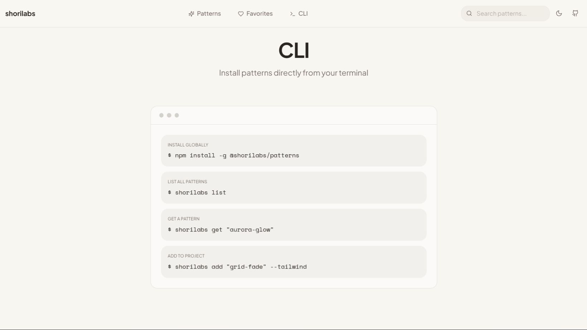
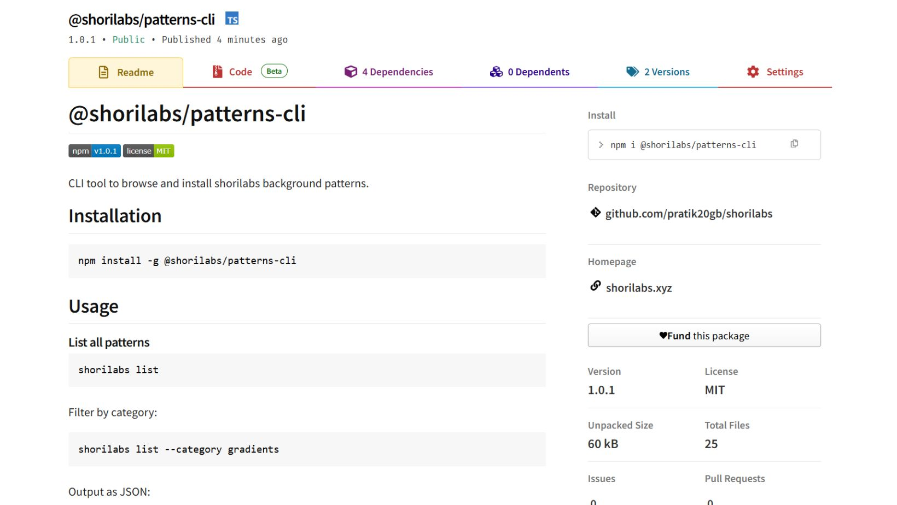

<div align="center">
  
</div>

# shorilabs 🎨

> Beautiful CSS and Tailwind background patterns for modern web projects

[](https://shorilabs.xyz)
[](https://www.npmjs.com/package/@shorilabs/patterns-cli)
[](LICENSE)

**🌐 Live Website:** [shorilabs.xyz](https://shorilabs.xyz)

## 📸 Screenshots

<div align="center">
  
  <br /><br />
  
  <br /><br />
  
</div>

## ✨ Features

- 🎨 **100+ Patterns** - Gradients, geometric shapes, decorative effects, and more
- 📋 **One-Click Copy** - CSS and Tailwind CSS versions for every pattern
- 🌓 **Dark Mode Ready** - All patterns work beautifully in both light and dark themes
- ❤️ **Favorites System** - Save your favorite patterns locally
- 🔍 **Search & Filter** - Find patterns quickly by name or category
- 📱 **Fully Responsive** - Beautiful on all screen sizes
- 🚀 **Fast & Lightweight** - Built with Vite and optimized for performance
- 💾 **Export All** - Download all patterns as JSON
- 💻 **CLI Tool** - Install patterns directly from the command line

## 🚀 Quick Start

### Prerequisites

- Node.js 18+ and npm

### Installation

```bash
# Clone the repository
git clone https://github.com/pratik20gb/shorilabs.git

# Navigate to project directory
cd shorilabs

# Install dependencies
npm install

# Start development server
npm run dev
```

Visit `http://localhost:8080` to see the app running locally, or check out the [live website](https://shorilabs.xyz)!

### CLI Installation

Install the CLI tool globally from npm:

```bash
npm install -g @shorilabs/patterns-cli
```

Then use it:

```bash
shorilabs list
shorilabs get aurora-glow
shorilabs search gradient
```

**For development:**

```bash
cd cli
npm install
npm run build
npm link  # Makes 'shorilabs' command available globally
```

## 📦 Build

```bash
# Production build
npm run build

# Preview production build
npm run preview
```

## 🎯 Usage

1. **Browse Patterns** - Scroll through 100+ beautiful patterns
2. **Filter by Category** - Click category pills to filter (Gradients, Geometric, Decorative, Effects)
3. **Search** - Use the search bar to find specific patterns
4. **Preview** - Click any pattern to see it in full-screen with code
5. **Copy Code** - Toggle between CSS and Tailwind, then copy to clipboard
6. **Save Favorites** - Click the heart icon to save patterns you love
7. **Download All** - Export all patterns as JSON for offline use

## 🛠️ Tech Stack

- **Framework:** React 18
- **Build Tool:** Vite 5
- **Language:** TypeScript
- **Styling:** Tailwind CSS
- **UI Components:** shadcn/ui
- **Animations:** Framer Motion
- **Theme:** next-themes
- **Icons:** Lucide React

## 📂 Project Structure

```
src/
├── components/
│   ├── ui/              # shadcn/ui components
│   ├── Header.tsx       # Main header with search and theme toggle
│   ├── Logo.tsx         # Logo component
│   ├── PatternCard.tsx  # Individual pattern card
│   ├── PatternGrid.tsx  # Pattern grid with filtering
│   ├── PatternPreviewModal.tsx  # Full-screen pattern preview
│   ├── CLISection.tsx   # CLI documentation section
│   └── Footer.tsx       # Footer with links
├── data/
│   └── patterns.ts      # All 100+ pattern data
├── pages/
│   ├── Index.tsx        # Home page
│   └── NotFound.tsx     # 404 page
├── lib/
│   └── utils.ts         # Utility functions
└── App.tsx              # App root with providers
```

## 🎨 Pattern Categories

### Gradients (20 patterns)
Beautiful gradient backgrounds including Aurora Glow, Cyber Sunset, Neon Horizon, Arctic Blue, Forest Depth, and more.

### Geometric (50 patterns)
Comprehensive collection including grids, dots, hexagons, diagonal lines, crosses, triangles, isometric cubes, checkerboard, weave patterns, houndstooth, circuit boards, blueprints, and much more.

### Decorative (16 patterns)
Noise textures, spotlights, corner glows, wave patterns, starbursts, radial glows, and organic blobs.

### Effects (23 patterns)
Blur orbs, glass morphism, frosted glass, mesh gradients, animated gradients, vignettes, scanlines, neon grids, holographic effects, and plasma patterns.

## 💻 CLI Usage

After installing the CLI, you can use it from anywhere:

```bash
# List all patterns
shorilabs list

# List patterns by category
shorilabs list --category gradients

# Get a specific pattern
shorilabs get aurora-glow

# Get only CSS
shorilabs get aurora-glow --format css

# Add pattern to your project
shorilabs add aurora-glow --file styles/patterns.css

# Add as Tailwind classes
shorilabs add grid-fade --tailwind --file styles/patterns.css

# Search patterns
shorilabs search aurora
```

## 📝 Adding New Patterns

To add a new pattern, edit `src/data/patterns.ts`:

```typescript
{
  id: "your-pattern-id",
  name: "Your Pattern Name",
  category: "gradients" | "geometric" | "decorative" | "effects",
  isNew: true, // Optional: shows "New" badge
  css: `background: your-css-here;`,
  tailwind: `bg-[your-tailwind-classes]`,
}
```

After adding patterns, export them for the CLI:

```bash
npm run export-patterns
```

## 📦 Packages

This repository contains the following npm packages:

- **[@shorilabs/patterns-cli](https://www.npmjs.com/package/@shorilabs/patterns-cli)** - CLI tool to browse and install patterns

## 🤝 Contributing

Contributions are welcome! Please feel free to submit a Pull Request.

1. Fork the repository
2. Create your feature branch (`git checkout -b feature/AmazingPattern`)
3. Commit your changes (`git commit -m 'Add some AmazingPattern'`)
4. Push to the branch (`git push origin feature/AmazingPattern`)
5. Open a Pull Request

See [CONTRIBUTING.md](CONTRIBUTING.md) for more details.

## 📄 License

This project is open source and available under the [MIT License](LICENSE).

## 🔗 Links

- **Website:** [shorilabs.xyz](https://shorilabs.xyz)
- **npm Package:** [@shorilabs/patterns-cli](https://www.npmjs.com/package/@shorilabs/patterns-cli)
- **GitHub:** [github.com/pratik20gb/shorilabs](https://github.com/pratik20gb/shorilabs)
- **Twitter:** [@sage_pratik](https://twitter.com/sage_pratik)

---

<div align="center">
  
  <br />
  <p>© 2025 shorilabs. All rights reserved.</p>
</div>
