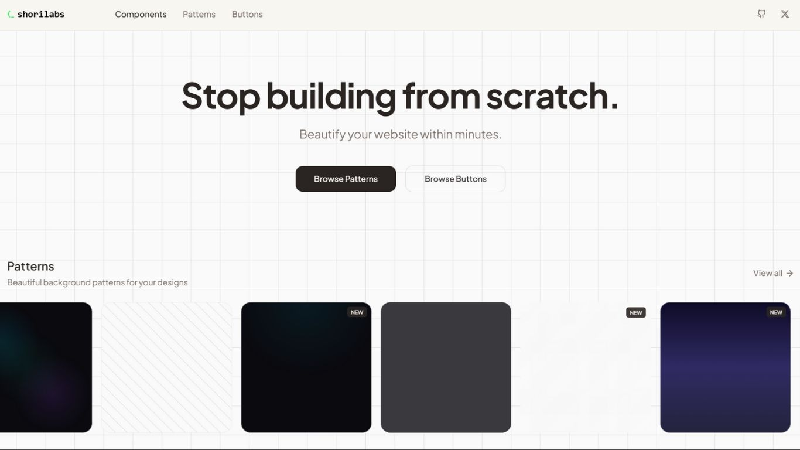
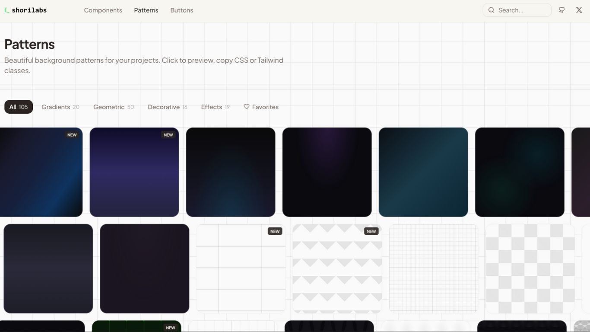
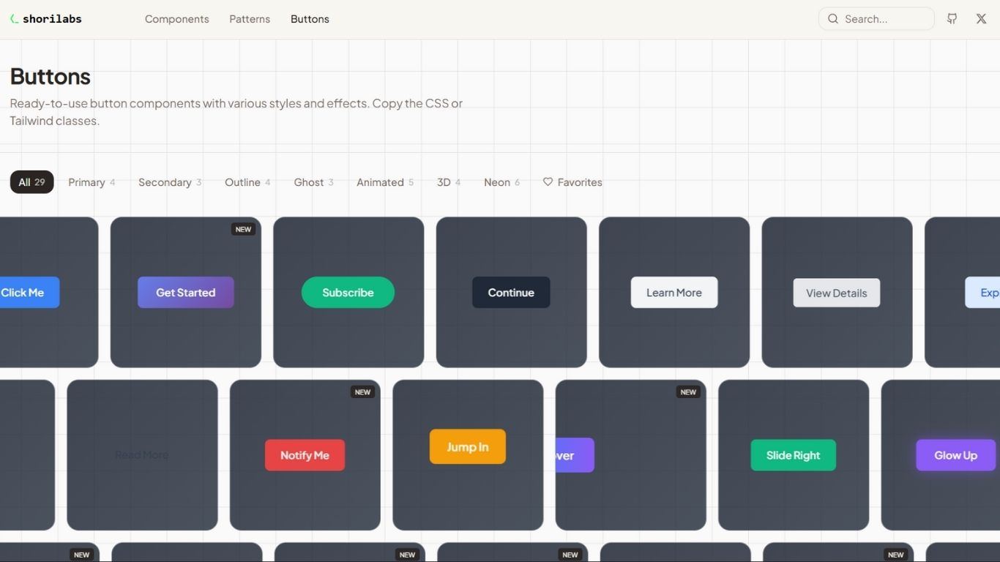
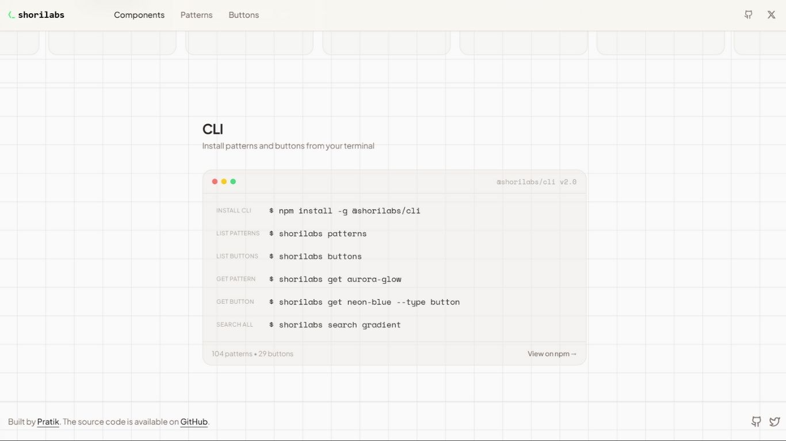

<div align="center">
  
</div>

<p align="center">
  <strong>Beautiful CSS & Tailwind patterns and buttons for modern web projects</strong>
</p>

<p align="center">
  <a href="https://shorilabs.xyz">
    
  </a>
  <a href="https://www.npmjs.com/package/@shorilabs/cli">
    
  </a>
  <a href="LICENSE">
    
  </a>
</p>

---

## 📸 Screenshots

<div align="center">
  
  <br /><br />
  
  <br /><br />
  
  <br /><br />
  
</div>

---

## ✨ Features

- 🎨 **100+ Patterns** - Gradients, geometric shapes, decorative effects, and more
- 🔘 **29+ Buttons** - Primary, secondary, outline, ghost, animated, 3D, and neon styles
- 📋 **One-Click Copy** - CSS and Tailwind CSS versions for every component
- 👁️ **Live Preview** - Preview patterns directly on the website background
- ❤️ **Favorites System** - Save your favorite patterns and buttons locally
- 🔍 **Search & Filter** - Find components quickly by name or category
- 📱 **Fully Responsive** - Beautiful on all screen sizes
- 🚀 **Fast & Lightweight** - Built with Vite and optimized for performance
- 💻 **CLI Tool** - Install patterns and buttons directly from the command line

## 🚀 Quick Start

### Prerequisites

- Node.js 18+ and npm

### Installation

```bash
# Clone the repository
git clone https://github.com/pratik20gb/shorilabs.git

# Navigate to project directory
cd shorilabs

# Install dependencies
npm install

# Start development server
npm run dev
```

Visit `http://localhost:8080` to see the app running locally, or check out the [live website](https://shorilabs.xyz)!

### CLI Installation

Install the CLI tool globally from npm:

```bash
npm install -g @shorilabs/cli
```

Then use it:

```bash
# List all patterns
shorilabs patterns

# List all buttons  
shorilabs buttons

# Get a specific pattern
shorilabs get aurora-glow

# Get a specific button
shorilabs get neon-blue --type button

# Search across all components
shorilabs search gradient
```

## 📦 Build

```bash
# Production build
npm run build

# Preview production build
npm run preview
```

## 🎯 Usage

1. **Browse Components** - Scroll through patterns and buttons on the home page
2. **Filter by Category** - Click category pills to filter components
3. **Search** - Use the search bar to find specific components
4. **Preview Patterns** - Click "Preview" to see patterns on the website background
5. **Copy Code** - View CSS and Tailwind code, then copy to clipboard
6. **Save Favorites** - Click the heart icon to save components you love

## 🛠️ Tech Stack

- **Framework:** React 18
- **Build Tool:** Vite 5
- **Language:** TypeScript
- **Styling:** Tailwind CSS
- **UI Components:** shadcn/ui
- **Animations:** Framer Motion
- **Icons:** Lucide React

## 📂 Project Structure

```
src/
├── components/
│   ├── ui/              # shadcn/ui components
│   ├── Header.tsx       # Main header with navigation
│   ├── HeroSection.tsx  # Landing page hero
│   ├── PatternCard.tsx  # Individual pattern card
│   ├── PatternGrid.tsx  # Pattern grid with filtering
│   ├── ButtonCard.tsx   # Individual button card
│   ├── ButtonGrid.tsx   # Button grid with filtering
│   ├── CLISection.tsx   # CLI documentation section
│   └── Footer.tsx       # Footer with links
├── data/
│   ├── patterns.ts      # All 100+ pattern data
│   └── buttons.ts       # All 29+ button data
├── contexts/
│   └── BackgroundPatternContext.tsx  # Global pattern preview state
├── pages/
│   ├── Index.tsx        # Home page
│   └── NotFound.tsx     # 404 page
├── lib/
│   ├── utils.ts         # Utility functions
│   └── patternUtils.ts  # Pattern parsing utilities
└── App.tsx              # App root with providers
```

## 🎨 Pattern Categories

- **Gradients** - Aurora, sunset, neon, arctic, forest, and more
- **Geometric** - Grids, dots, hexagons, triangles, isometric cubes
- **Decorative** - Noise, spotlights, waves, starbursts, blobs
- **Effects** - Blur orbs, glass morphism, mesh gradients, holographic

## 🔘 Button Categories

- **Primary** - Solid, prominent call-to-action buttons
- **Secondary** - Subtle, secondary action buttons
- **Outline** - Border-only buttons with hover fill
- **Ghost** - Minimal buttons for tertiary actions
- **Animated** - Buttons with hover animations
- **3D** - Buttons with depth and shadow effects
- **Neon** - Glowing, cyberpunk-style buttons

## 💻 CLI Usage

```bash
# List patterns
shorilabs patterns
shorilabs patterns --category gradients

# List buttons
shorilabs buttons
shorilabs buttons --category neon

# Get component CSS
shorilabs get aurora-glow
shorilabs get neon-blue --type button

# Add to project
shorilabs add aurora-glow --file styles.css
shorilabs add neon-blue --type button --file buttons.css

# Search all components
shorilabs search glow

# Show CLI info
shorilabs info
```

## 📝 Adding New Components

### Adding Patterns

Edit `src/data/patterns.ts`:

```typescript
{
  id: "your-pattern-id",
  name: "Your Pattern Name",
  category: "gradients" | "geometric" | "decorative" | "effects",
  isNew: true,
  css: `background: your-css-here;`,
  tailwind: `bg-[your-tailwind-classes]`,
}
```

### Adding Buttons

Edit `src/data/buttons.ts`:

```typescript
{
  id: "your-button-id",
  name: "Your Button Name",
  category: "primary" | "secondary" | "outline" | "ghost" | "animated" | "3d" | "neon",
  label: "Click Me",
  isNew: true,
  css: `your-button-css-here`,
  tailwind: `your-tailwind-classes`,
}
```

After adding components, export them for the CLI:

```bash
npm run export-patterns
```

## 📦 Packages

- **[@shorilabs/cli](https://www.npmjs.com/package/@shorilabs/cli)** - CLI tool to browse and install patterns & buttons

## 🤝 Contributing

Contributions are welcome! Please feel free to submit a Pull Request.

1. Fork the repository
2. Create your feature branch (`git checkout -b feature/AmazingFeature`)
3. Commit your changes (`git commit -m 'Add some AmazingFeature'`)
4. Push to the branch (`git push origin feature/AmazingFeature`)
5. Open a Pull Request

## 📄 License

This project is open source and available under the [MIT License](LICENSE).

## 🔗 Links

- **Website:** [shorilabs.xyz](https://shorilabs.xyz)
- **npm Package:** [@shorilabs/cli](https://www.npmjs.com/package/@shorilabs/cli)
- **GitHub:** [github.com/pratik20gb/shorilabs](https://github.com/pratik20gb/shorilabs)
- **X:** [@sage_pratik](https://twitter.com/sage_pratik)

---

<div align="center">
  
  <br /><br />
  <p>Made with ❤️ by <a href="https://thepratik.xyz"><strong>Pratik</strong></a></p>
</div>
